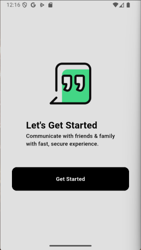
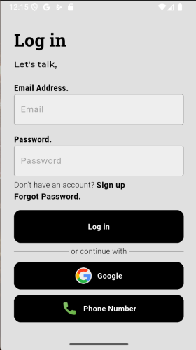
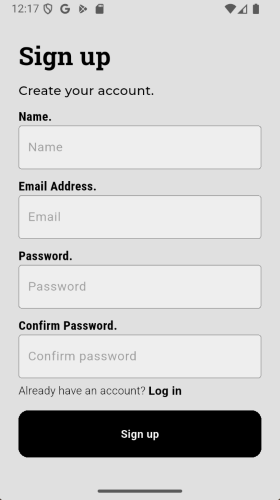
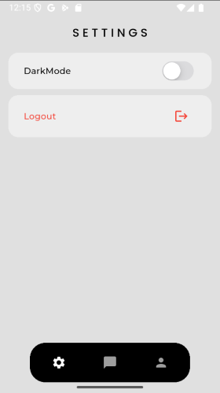

# 📱 Flutter Messenger App

A modern messenger app built using **Flutter** and **Firebase**, supporting both **Android** and **Web** platforms. This app allows users to communicate securely via a sleek, user-friendly interface.

---

## ✨ Features

- 🔐 **Firebase Authentication**  
  Supports email/password login, Google sign-in, and phone number authentication(not yet).

- ☁️ **Cloud Firestore**  
  Real-time chat data is securely stored and synced using Firestore.

- 💡 **Dark Mode Toggle**  
  Users can easily switch between light and dark themes in the settings.

- 👤 **Profile Management**  
  Displays user information such as name and email on the profile screen.

- 🔧 **Settings Page**  
  Allows users to toggle dark mode and log out of their accounts.

- ✅ **First Launch Screen**  
  Introductory “Get Started” screen shown only on first app launch.

- 🌐 **Cross-Platform**  
  Fully functional on both Android and Web platforms.

---

## 📸 Screenshots

### 1. Get Started Screen  


### 2. Login Screen  


### 3. Sign Up Screen  


### 4. Messenger (Home) Screen  


### 5. Settings Screen  


### 6. Profile Screen  


---

## 🚀 Getting Started

### Prerequisites

- Flutter SDK (>=3.0.0)
- Firebase Project with Authentication and Firestore enabled
- Android Studio / VS Code

### Setup Instructions

1. **Clone the repository**
   ```bash
   git clone https://github.com/vedantvisoliya/Flutter-Messenger-App.git
   cd messenger_app
   ```
2. **Install Dependencies**
    ```bash
    flutter pub get
    ```

3. **Configure Firebase**
    Add google-services.json for Android and firebase_options.dart for Web (via flutterfire configure).
    Make sure Firebase Authentication and Firestore are enabled in the Firebase Console.
    Also SHA1 and SHA256

4. **Locally Run App**
    ```bash
    flutter run -d chrome   # for web
    flutter run -d android  # for android
    ```

## 🛠️ Tech Stack
    Flutter
    Firebase Auth
    Cloud Firestore
    Provider or Riverpod (state management - based on your choice, used provider in this.)
    Material 3 UI

## 🔐 Authentication Methods Supported
    Email & Password (via Firebase)
    Google Sign-In (via Firebase)
    Phone Number Verification (via Firebase) (in process)

## 🙌 Contributions
    Feel free to open issues or submit pull requests if you'd like to improve the app!